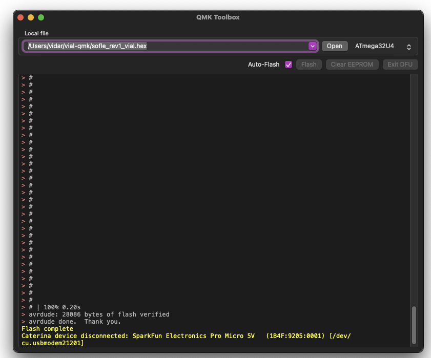

1. open QMK toolbox compiler 
2. Set path to `sofle_rev1_vial.hex`
3. Connect left side keyboard
4. Select auto-flash, click on reset button. Wait for flash
5. Unplug left side, connect right side, click on reset button. Wait for flash.
6. Go to vial.rocks and upload `keyboard-layout.vil`

